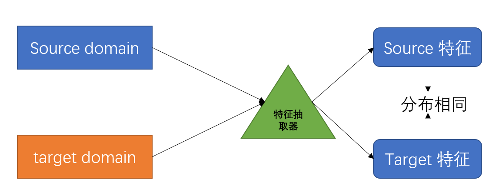
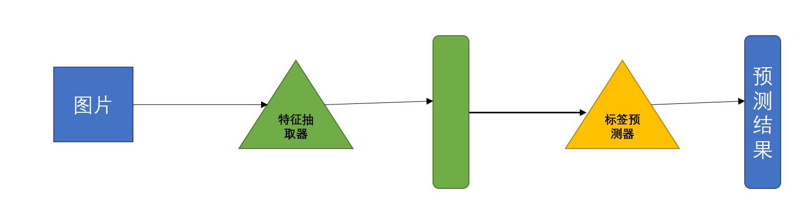
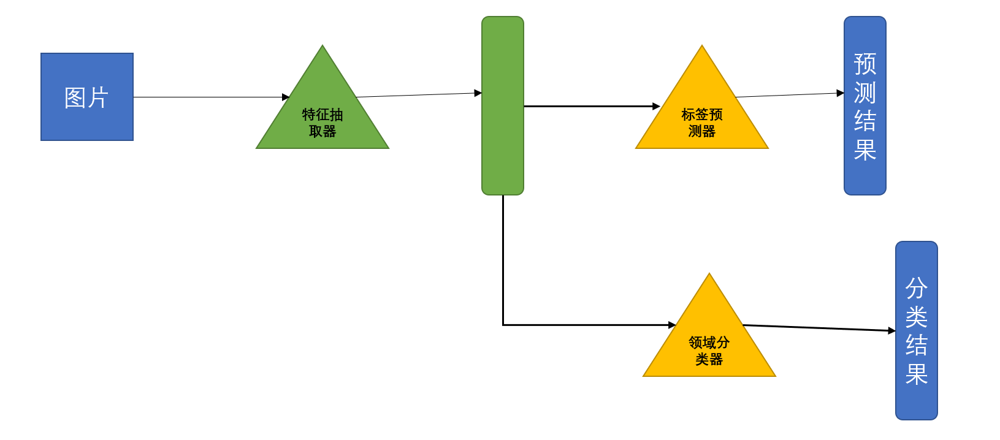

# Module11-DomainAdaptation(领域自适应)
DomainShift:训练资料和测试资料的分布不一样。  
可以看成迁移学习的一种。  
即从A资料集上学习的模型，应用在B资料集上。  
DomainShift的类型:  
+ 输入分布不同。
+ 输出分布不同。 
+ 训练和测试的分布一样，但是输入和输出对应的关系不同。  

这里只探究第一种。  
训练集称为source domain，测试集称为target domain。  

如果有少部分的关于测试集的信息，可以先用source domain的数据来训练模型，然后使用这一少部分数据对模型进行fine-tune。(参考BERT)   
但是要小心过拟合。    
如果测试集数据较多，可以直接在测试集上开展训练。  

+ 情况1:在target domain上有着大量信息，但是这些数据却并没有label。(Large amount of unlabeled data)  

基本想法:  
训练一种特征抽取器:可以理解为，训练了一种特征抽取器，分别从source domain和target domain上抽取特征，两个domain抽取的特征分布相同，因此可以使用source domain的抽取结果来训练模型，再对target domain的抽取结果进行测试即可。  
   

可以把一个神经网络模型的前几层看成特征抽取器(Feature Extractor)，后面几层看成标签预测器(Label Predictor)  
    

下面开始讨论如训练总体来说类似于GAN。  
    
将中间网络的特征送入领域分类器，使其辨别特征是抽取自source domain还是target domain，直到特征抽取器返回的结果使得领域分类器无法分辨其来源时，说明了特征抽取器学习完毕。  
+ 特征抽取器: Generator  
+ 领域分类器: Discriminator  

此处还有一个问题，截至目前，都假定的source domain的总类别和target domain的总类别的数量相同，但是实际操作中，二者的类别并不一定会相同。  

举例来说，source domain有3类，但是target domain有4类。对于这种情况，应当这么处理:  
参见: Unibersal domain adaptation  

如果只有少量的target domain 同时还没有标注。 这个时候应当考虑Testing Time Training.(TTT)  

如果对target domain一无所知，这个时候该考虑Domain Generalization。  
