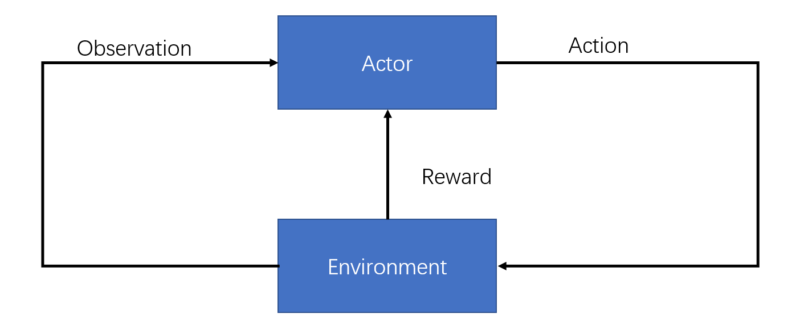
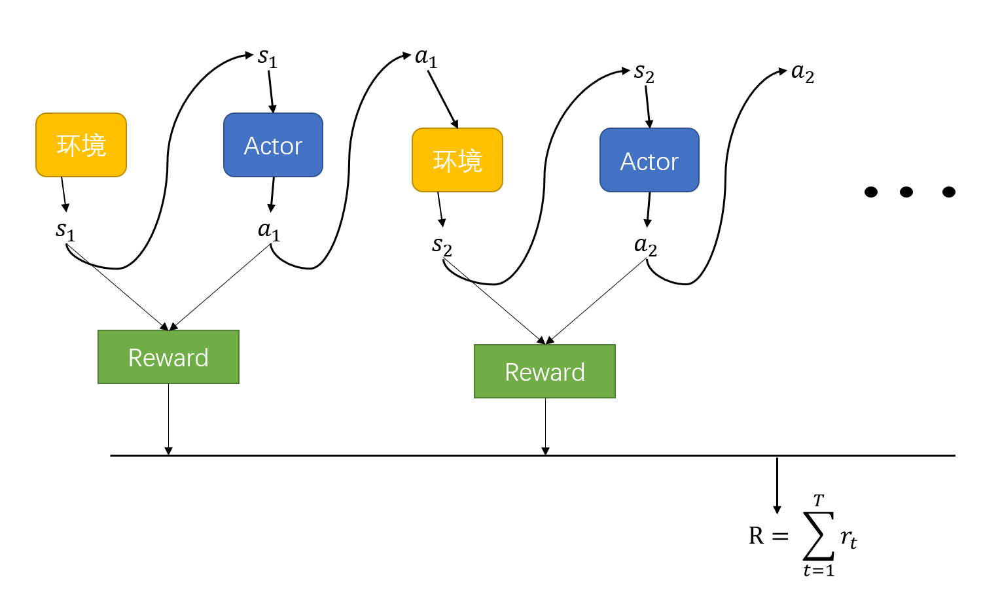
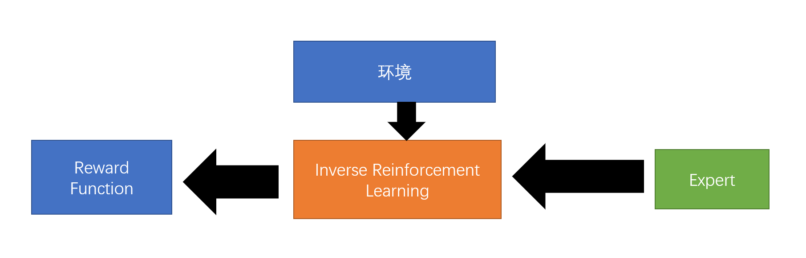

# 强化学习(ReinforcementLearning)  
当给及其一个输入的时候，无法判定最佳的输出是什么。  
但是机器直到输出的好坏。  
## 一、强化学习的定义  
在强化学习中，存在Actor和Environment。  
   
环境给Actor一个Observation作为输入，Actor输出一个Action给环境，二者相互互动。同时环境会给Actor一个Reward来告诉Actor其输出到底是好是坏。  
Actor就可以视为我们的目标函数，目标是寻找一个函数，使环境给的reward的总和最大。  
步骤:  
+ Function With Unknown: Policy Network(输入为环境，输出为每一个可以采取的行为)  
+ Define Loss: $ob_1\rightarrow a_1 \rightarrow reward_1\rightarrow ob_2\rightarrow a_2 \rightarrow reward_2\rightarrow...reward_n(游戏结束)$。      
  从开始到结束的过程称之为一个episode，每一个episode所有的reward加起来得到Total Reward:$R = \sum_{t=1}^Tr_t$，这里的Total Reward越大越好。那么为了最小化loss，负的total reward就是我们的优化对象。  

+ Optimization:
   
  学习Actor的参数来优化R,使得R越大越好。  
这里会有一些问题；  
    (1)Actor的输出是有一定随机性的。  
    (2)Env不是神经网络的一部分，他只是一个黑箱，甚至拥有随机性。  
    (3)Reward也不是神经网络的一部分，也只是一个黑箱，同时具有一定的随机性。  

相当于一个Discriminator不是神经网络而是黑箱的GAN。  

## 二、Policy　Gradient  
如何掌控Antor的行为。  
对于想要其采取的行为和不想其采取的赋相反的符号。  
当然不一定采用binary策略，也可以使用连续的策略。   
先观察一个训练好的Actor，记录其多个episodes的s-a信息对。  
但是每个行为都会影响到接下来的环境，每一个行为并不是独立的。  
有时候还需要短期利益，来获取长期利益。  

正式的Policy Gradient:  
+ 收集到一个episode的信息:   
$s_1,s_2,s_3,...,s_n$  
$a_1,a_2,a_3,...,a_n$  
$r_1,r_2,r_3,...,r_n$   
    + $a_1$的reward不再只是$r_1$，而是变成了后续所有reward的和(cumulated reward):   
        $G_1 = r_1+r_2+r_3+...+r_n$   
        $G_2 = r_2+r_3+...+r_n$   
        $G_n = r_t+r_{t+1}+...+r_n$
+ 2.0改进:随着强化学习的进行，后续的reward与最开始的行动的关系越来越弱，因此有公式:  
    +  收益改为:$G_1' = r_1 + \gamma r_2 + \gamma^2r_3+...(\gamma \lt 1)$    
这样写离$a_1$比较远的reward对其总reward的影响就会较小。    
+ 3.0改进:reward是相对的，如果只是单纯的计算G，那么会出现一个问题:如果当前环境反馈给actor的reward永远是正值，所以所有活动都会被鼓励。   
设定$A_1 = G_1'-b$......$A_n = G_n'-b$

越早的动作就会累积到越高的分数，越晚的动作就会累积到越低的分数。    
强化学习步骤: 
+ 初始化Actor的参数$\theta^0$。
+ 进入训练循环(1-T):  
    + 使用$\theta^{i-1}$来作为actor的参数。  
    + 收集当前参数下的actor活动数据，得到s-a对。  
    + 计算$A_1,A_2,...,A_n$  
    + 计算损失值  
    + 更新参数$\theta^i = \theta^{i-1}-\eta\Delta L$   

注意，RL的收集数据在训练过程中收集，训练多少次，就得收集多少次数据。  

## 三、Actor-Critic  
### Critic  
+ 作用: 给定一个actor$\theta$,当环境给actor一个输入$s$的时候，actor如果采取行动，会得到多少reward。  
+ Value Function $V^\theta(s):$当设定一个actor $\theta$，这个actor看到环境的反馈$s$后给的discounted cumulated reward。    
  可以理解为，Value Function是想在游戏结束之前，只看到了环境的一个反馈，就想猜测正常游戏结束后得到的dis counted cumulated reward。  
  同样的游戏画面，不同的actor，Value Function的数值也会不同。  

### Critic的训练过程:
+ MC:蒙特卡洛模拟，直接让actor去和环境进行互动，从而到最后看到了环境反馈$s_a$，就可以得出reward。  
+ TD approach:  
  $V^\theta (s_t) = \gamma V^\theta (s_{t+1})+r_t$  

当我们训练好Critic之后，只要给Critic一个s，Critic就可以返回一个分数。可以把critic的分数来作为上文训练actor时，标准化reward时所需要的b。  
$A_1 = G_1' - V^\theta(s_1)\\
A_2 = G_2' - V^\theta(s_2)\\
A_3 = G_3' - V^\theta(s_3)\\
......\\
A_t = G_t' - V^\theta(s_t)$  

$V^\theta(s_t)$:看到画面$s_t$后，可以得到的reward的期望值。  

$A_t = r_t+V^\theta (s_{t+1})- V^\theta(s_t)$  

Actor和Critic的部分神经网络是可以共用的。  

## 四、Reward Shaping  
Sparse Reward:如果大部分的Reward是0，会比较难训练。  
解决方法: 想办法提供额外的reward，来使得Agent进行学习。(Reward Shaping)   

## 五、No Reward  
reward只在部分环节中比较容易被定义，但是很多场景是没有reward。   
在没有reward情况下，让机器自行和环境互动来学习的这种方法，称为Imitation Learning。  
在这种学习方式中，Actor仍然可以和环境互动，但是并不会得到环境的reward，但是环境会有observation(也就是s)。  

我们可以给Actor提供示范(一般是人类行为)。  

Imitation Learning的主要任务就是通过示范以及Actor和环境的互动来学习。  
但是这样的情况下可能会导致机器高度复制示范结果。这种问题的解决办法是Inverse Reinforcement Learning  

具体来说是学习一个Reward Function。通过(环境、示范)  
    

+ 训练原则:Expert的行为是最好的。  
+ Baseline:
    + 初始化一个Actor。
    + 在每轮迭代里:
      + 让actor和环境进行互动，收集信息。
      + 定义一个reward function，使得expert的分数总是好于actor的分数。  
      + 使得actor想办法最大化其对应的reward function值，更新actor的参数。
    + 输出reward function，同时输出actor。  