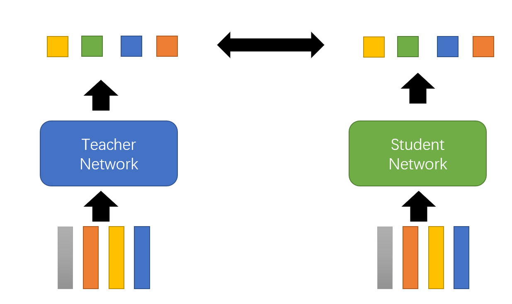
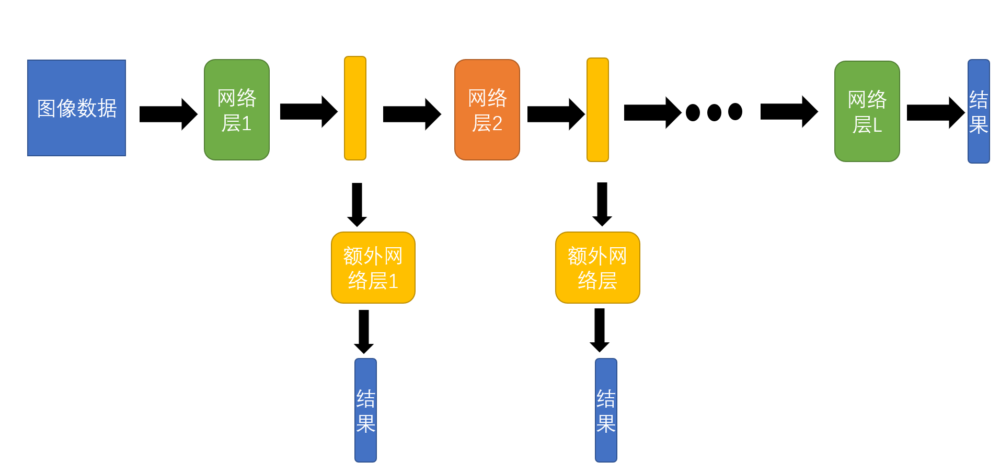

# 13.神经网络压缩  
在很多时候，模型会在部分资源比较有限的环境下使用和部署。所以部分过大的模型需要神经网络压缩。  
## 1.神经网络修剪(Network Pruning)  
把神经网络里的一些参数修剪掉。  
步骤:  
+ 首先训练一个巨大的神经网络模型。  
+ 评估模型中各个参数和神经元的重要性。  
+ 移除不重要的参数和神经元。  
+ 把剩下的没有被修剪的参数重新修改一下。  
+ 以上步骤可以反复进行多次。  

修剪的单位既可以用神经元为单位，也可以用参数为单位。
参数单位不方便pytorch实现(因为形状不固定)。

如果以神经元为单位来进行修剪，则有：  
丢掉一些神经元，比较好实现。 

## 2.知识抽取(Knowledge Distillation)  
先训练一个大型模型Teacher Network，而想要训练的是小模型称之为Student Network。  
如图所示，应该使得Student Network的输出分布尽可能和Teacher Network的输出分布相似。
   
那么为何不直接使得Student Nerwork向正确答案学习呢?   
因为这么操作的结果一般不如学习Teacher Network的结果好。  
原因是teacher输出的分布结果可能会给student提供一些额外的信息。  
还可以用多个网络进行Ensemble来作为Teacher Network的结果。  

首先重新温习一下softmax函数:  
$y_i' = \frac{exp(y_i)}{\sum_j exp(y_j)}$  
这里引进了一个Temperature for softmax函数:  
$y_i' = \frac{exp(y_i/T)}{\sum_j exp(y_j/T)}$  
T是一个需要调节的参数。 
使用这种softmax的函数的好处是可以平滑分布。  

## 3.参数压缩(Parameter Quantization)  
+ 使用尽可能少的空间来存储参数。  
+ 权重聚类。
+ 哈夫曼编码。  
## 4.结构设计(Architecture Design)   
### Depthwise Convolution  
+ 滤波器(Filter)的数量等于输入图片通道数。 
+ 每一个滤波器只专注于一个通道。
+ 输出的结果的通道数等于输入图片通道数。  
+ 这个网络的问题是图片的不同通道之间的交互是无能为力的。解决方法是做Pointwise Convolution。  

Pointwise Convolution:  
像正常CNN的滤波器一样的Filter，但是只有通道数x1x1那么大，只负责考虑通道之间的关系。  

Depthwise Convolution的参数比起一般的CNN来说参数大幅度减少。

## 5.动态计算(Dynamic Computation)   
希望神经网络可以自由调整其所需要的运算量。    
通过让network自由调整其深度来实现。  
可以加入一些Extra Layer来实现。 
   

如果算力不够，则直接走额外网络层1或者网络层2来输出结果即可。  

其他策略还有动态宽度之类的。  

让Network自行决定其宽度深度。