# Self-attention和Transfomer  
## 1.Self-attention 
+ 解决问题:Sequence to Sequence（序列输入到序列输出）   
输入是一组向量，同时组里的向量数目会发生变化。  
输出可能性有三种:输入长度和输出长度相同（词性标注）(Sequence Labeling)，一整个序列只需要一个输出，机器自行决定要输出多少(seq2seq)（机器翻译）。
+ 举例:  
文字处理。每个句子的长度不一样（如果把句子中每个词都描绘为一个向量）。   

如果使用全连接网络进行挨个输出，则无法考虑到序列本身带来的信息。  
例如:如果在进行词性标注任务时，假设向量1和向量3都是一个词，但是因为位置导致语义词性不同，但是使用简单的全连接网络会使得二者输出相同，因此设计一种网络兼顾向量本身和序列本身带来的信息。  

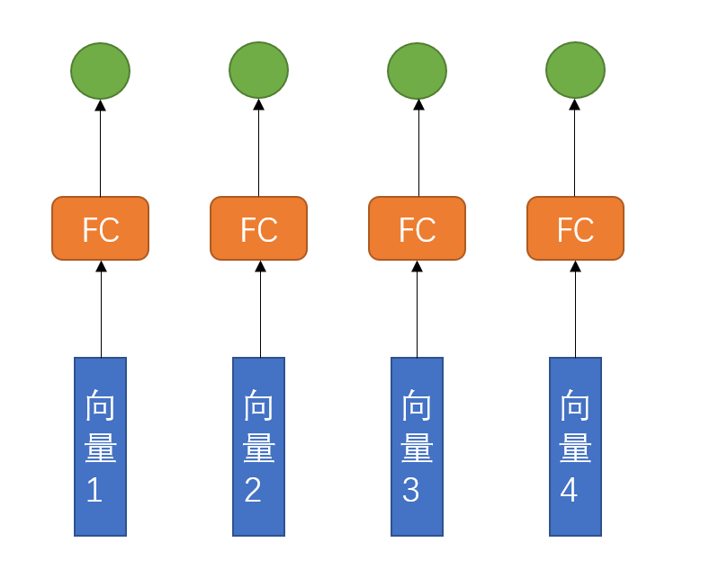 
Self-attention一次性读入整个Sequence里的向量，从而在分析某个向量的时候考虑上下文(整个Sequence)的信息。  
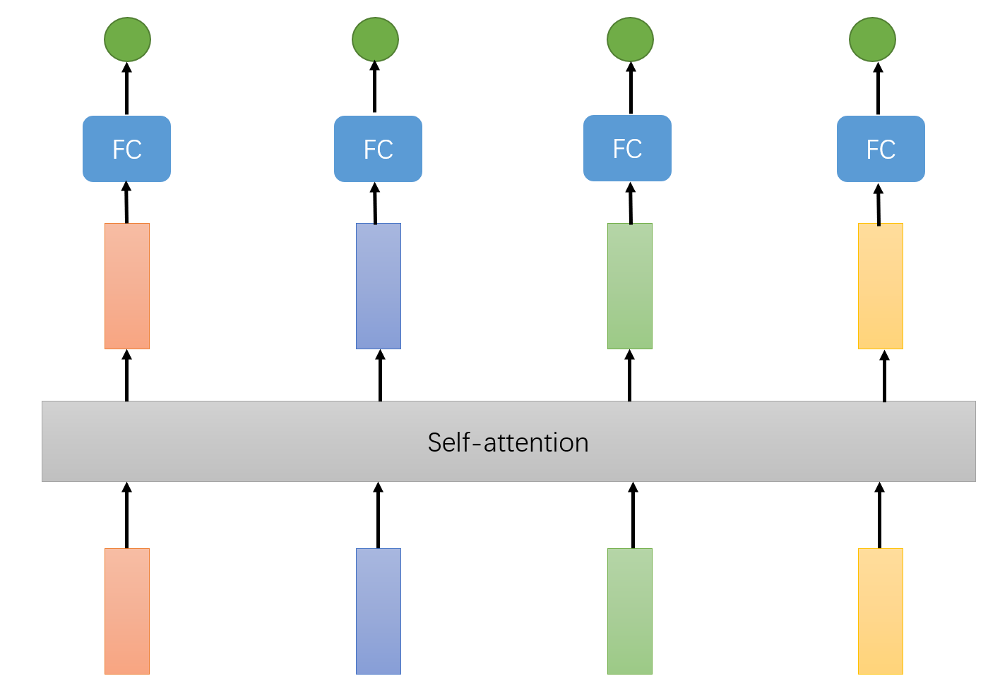
Self-attention输出的结果是考虑了整个句子的信息结合向量本身得出来的结果，同时，就输出的数量来说，输入多少向量，就会输出多少向量。  
### 1.1模型架构
接下来描述Self-attention的模型架构:  
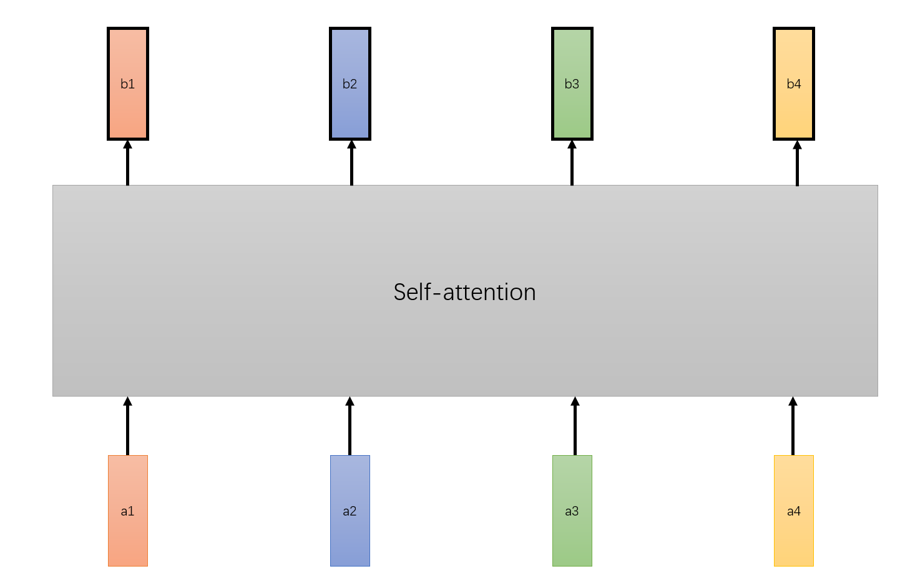  
如图所示，假设输入为一组向量[a1,a2,a3,a4]，输出为另一组向量[b1,b2,b3,b4]。b向量是由其对应的a及考虑序列关系得出的结果。  
Self-attention的计算步骤(以得到b1为例):  
#### 1.1.1计算a2,a3,a4和a1的关联性。  
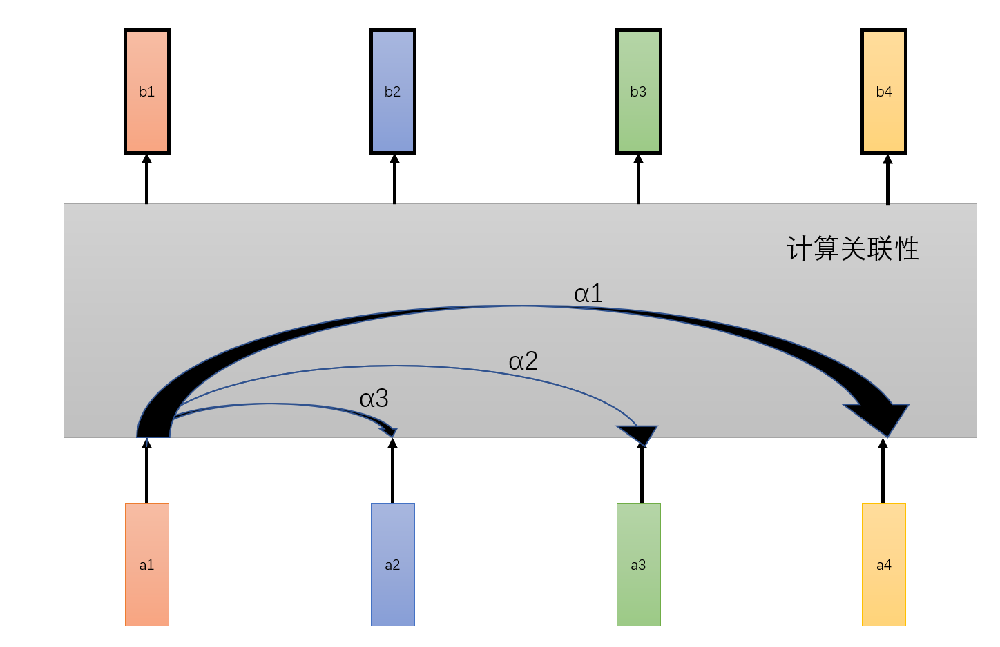
比较常见的计算两个向量关联度的方法是Dot-product和Additive。  
在本文只介绍Dot-product。  
如下图，首先将输入的两个向量分别乘以矩阵$W^q$和$W^k$得到向量q和k，再对q和k做点积，$\alpha = q \cdot k$，得到两个向量的关联值$\alpha$
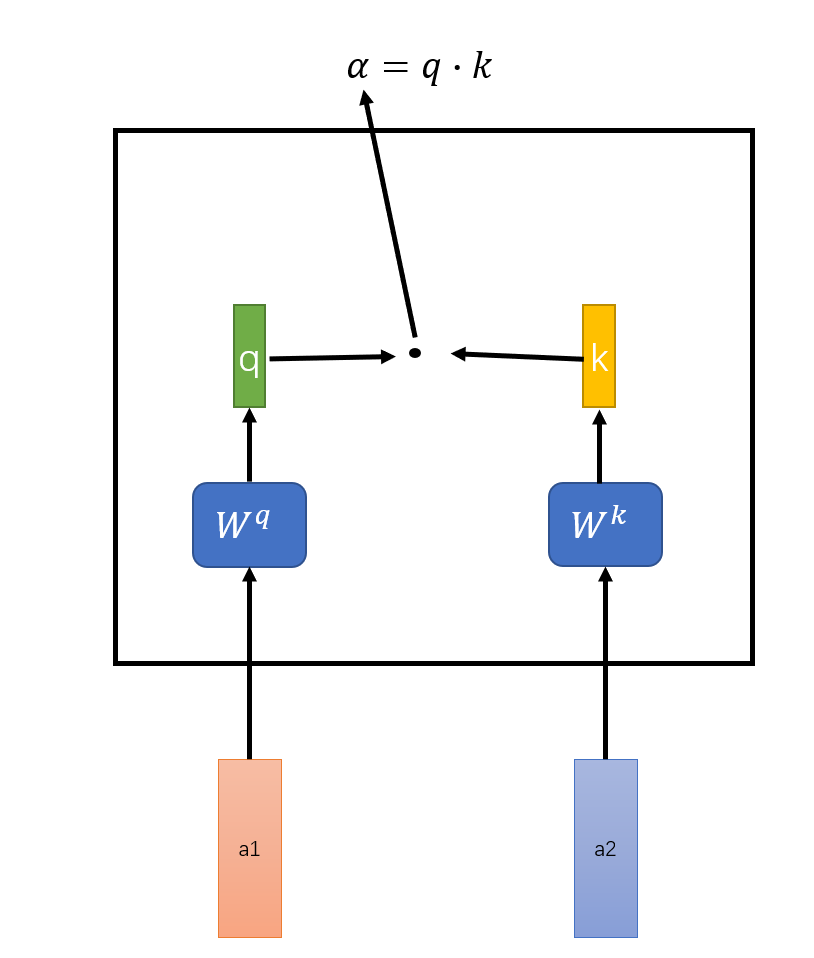  
一般在实践中，为了批量得到a1和a2,a3,a4之间的$\alpha$，通常会采用如下的方式: 
(1)将a1成矩阵$W^q$得到向量q1，然后用矩阵$W^k$一词乘a1,a2,a3,a4得到k1,k2,k3,k4.  
(2)计算q1和k1,k2,k3,k4的关联程度，得到$\alpha_{1,1},\alpha_{1,2},\alpha_{1,3},\alpha_{1,4}$  
(3)将得到的关联结果送入softmax函数(也可以换其他激活函数)，得到$\alpha_{1,1}',\alpha_{1,2}',\alpha_{1,3}',\alpha_{1,4}'$
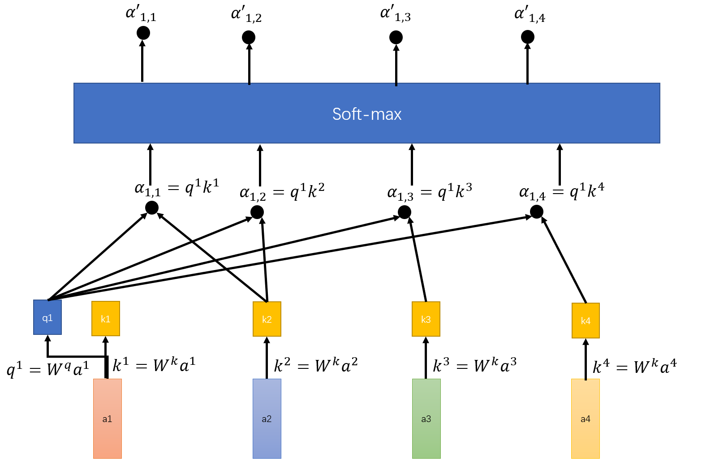  

注:<font color=red>关联值 $\alpha'$ 也称为attention score</font>
#### 1.1.2抽取重要信息
经过上一步后，我们已经得到了向量序列中各个向量和向量a1的关联程度，接下来，通过这个关联结果，来抽取重要信息。    
(1)首先针对a1,a2,a3,a4；我们使其每一个乘矩阵$W^v$得到新的向量v1,v2,v3,v4。  
(2)然后使得每个v1,v2,v3,v4分别乘其对应的$\alpha_{1,i}'$，然后将乘积结果相加，得到b1。即:$b^1 = \sum_i\alpha'_{1,i}v^i$。二者关联越大，对b1的影响就越大。  
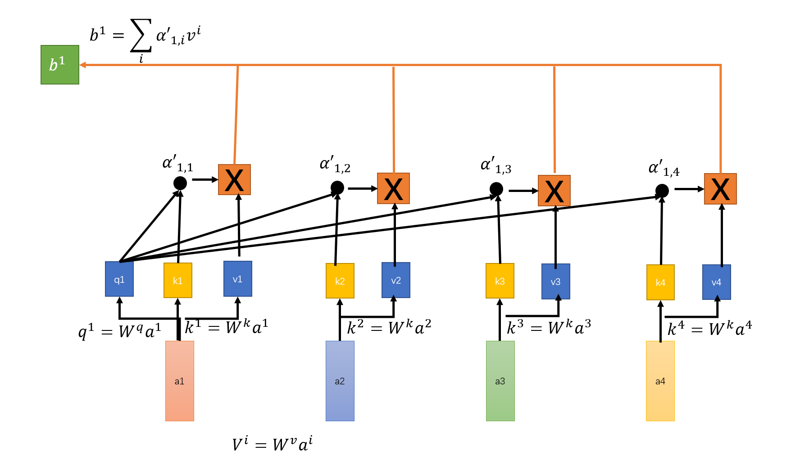  

<font color=red>经过上述步骤，我们可以从一整个sequence得到b1,b2,b3,b4。  
</font>
如果从矩阵乘法的角度来看，上述两个步骤的结果是这样的:  
+ 计算$q^i$:  
$q^i=W^qa^i$  
$[q^1,q^2,q^3,q^4]=W^q[a^1,a^2,a^3,a^4]$  
设$I = [a^1,a^2,a^3,a^4]$,$Q=[q^1,q^2,q^3,q^4]$  
则有:$Q=W^qI$

+ 计算$k^i$:  
$k^i=W^ka^i$  
$[k^1,k^2,k^3,k^4]=W^k[a^1,a^2,a^3,a^4]$  
设$I = [a^1,a^2,a^3,a^4]$,$K=[k^1,k^2,k^3,k^4]$  
则有:$K=W^kI$

+ 计算$v^i$:  
$v^i=W^va^i$  
$[v^1,v^2,v^3,v^4]=W^v[a^1,a^2,a^3,a^4]$  
设$I = [a^1,a^2,a^3,a^4]$,$V=[v^1,v^2,v^3,v^4]$  
则有:$V=W^vI$  

+ 计算$\alpha$:  
$[\alpha_{1,1},\alpha_{1,2},\alpha_{1,3},\alpha_{1,4}]=[k^1,k^2,k^3,k^4]\cdot q^1$  
$A'\leftarrow A = K^TQ$  

+ 计算$b^i$  
$B = V\cdot A'$  


+ 总结  
$Q = W^qI$  
$K = W^kI$  
$V = W^vI$  
$A=K^TQ$  
$A'\leftarrow A$  
$O=VA'$  
所以需要学习的参数，只有$W^k,W^q,W^v$。  

### 1.2 Multi-head Self-attention  
当我们在做Self-attention的时候，我们是在用$q^i=W^qa^i$来找当前向量和序列向量之间的相关性。  
Multi-head Self-attention 出于这么一种考虑，即一个q无法包含当前向量和序列向量之间的所有相关信息，因此提出了使用多个q来包含当前向量和序列向量之间的所有相关信息。  
因为q变多了，所以此时的k和v也应该变为多个。  
如下图所示(此处只有两个head):
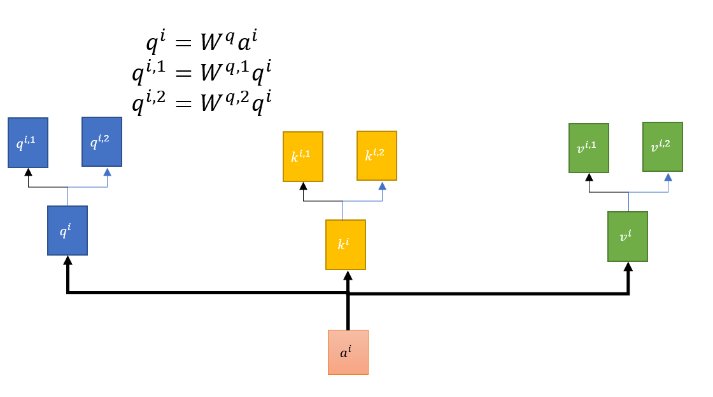  

### 1.3 位置编码
到目前为止，Self-attention仍然没有考虑到序列信息(因为attention score)只计算了相关性。
解决方法:位置编码(Positional Encoding)  
对位置进行编码，生成$e^i$，然后加上输入一起作为输入即可。  
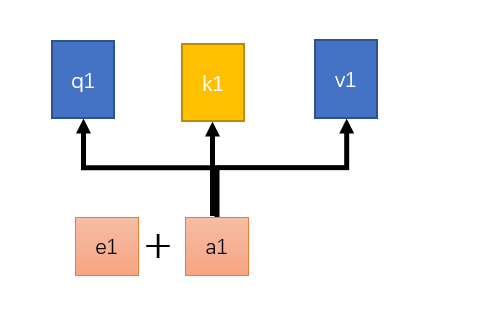  

## 2.Transfomer   
常用于处理Seq2Seq问题，即模型输出多少长度是由模型自己决定。例如机器翻译和语音辨识任务。 
Seq2Seq一般架构:  
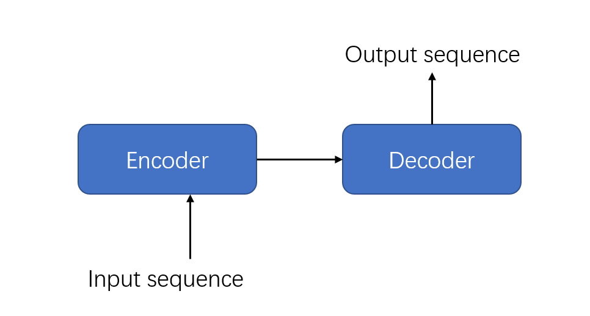    

### 2.1 Encoder
Input是sequence，Output也是同长度的sequence。  
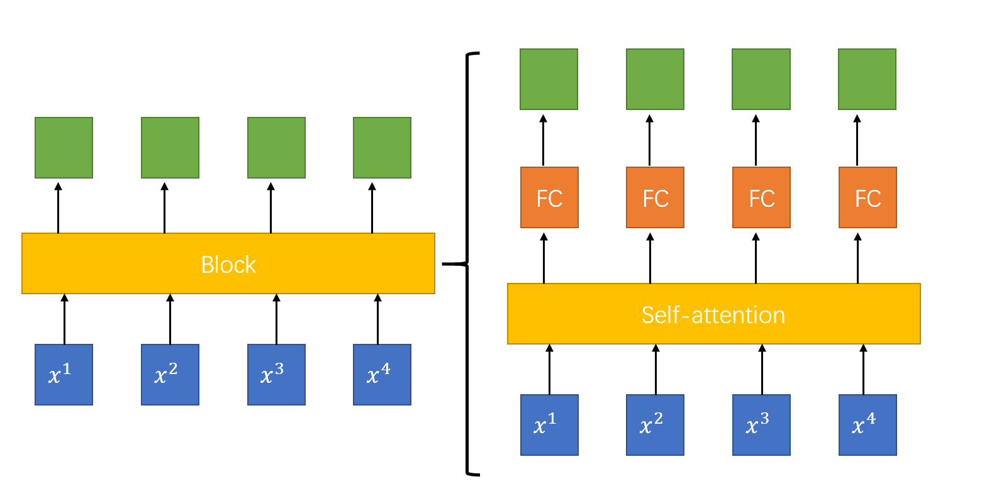    
解释其中的一个block:
在Transfomer里，Self-attenion里，输出的b不只是Self-attention的计算结果，输出b应该是b和原向量a的加和(residual)。
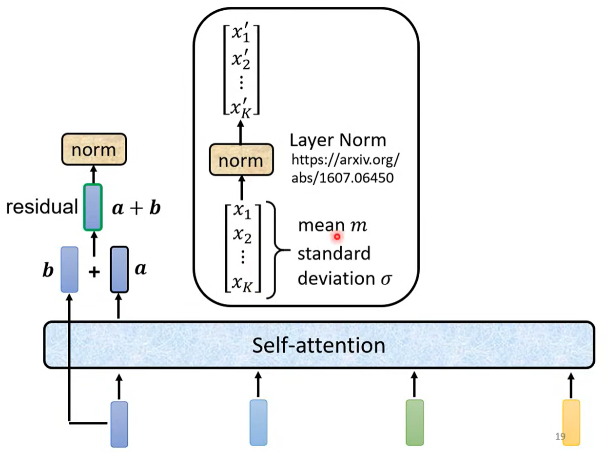    
residual完成后，将输出结果送入Norm进行标准化，标准化完成后输入全连接网络(FC)。   
FC的结果也需要进行residual，结果也要送入Norm一次，这样才是完成了一个Block的输出。  
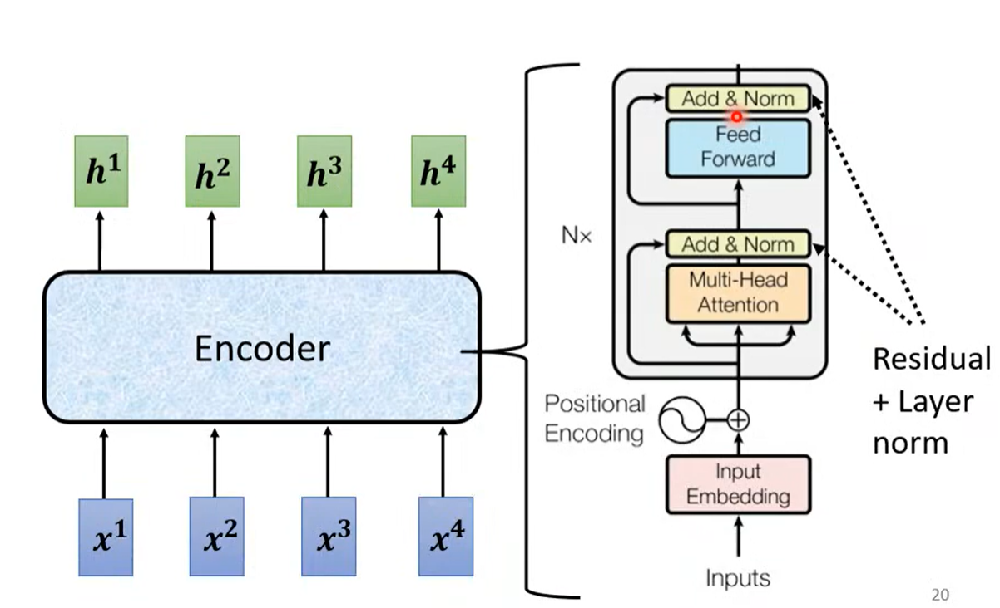    
注意这里的attention是Multihead的。  

### 2.2 Decoder  
+ AT Decoder(以语音辨识为例)  
Decoder读入Encoder的输出，然后产生文字作为输出。  
<font color=red>(1)首先需要给Decoder一个"BEGIN"符号。</font>  
Decoder读取Encoder的输出和BEGIN产生其第一个输出。  
输出的结果是一个向量，代表输出每个字的概率，所以输出向量长度是等于可取值的汉字的总数量。  
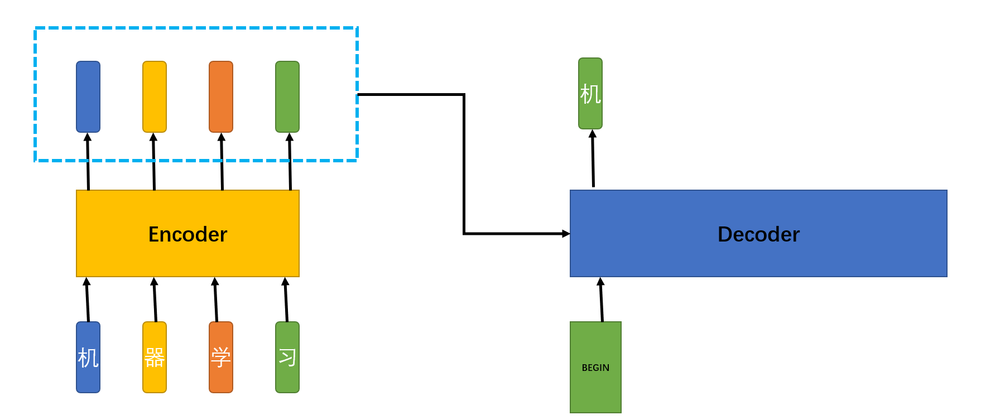      

(2接下来把第一个输出（在这里即是"机"字）又作为Decoder的输入，和BEGIN一起作为Decoder的输入，得到第二个输入"器"，也就是说Decoder会把自己的输出当作接下来的输入。  
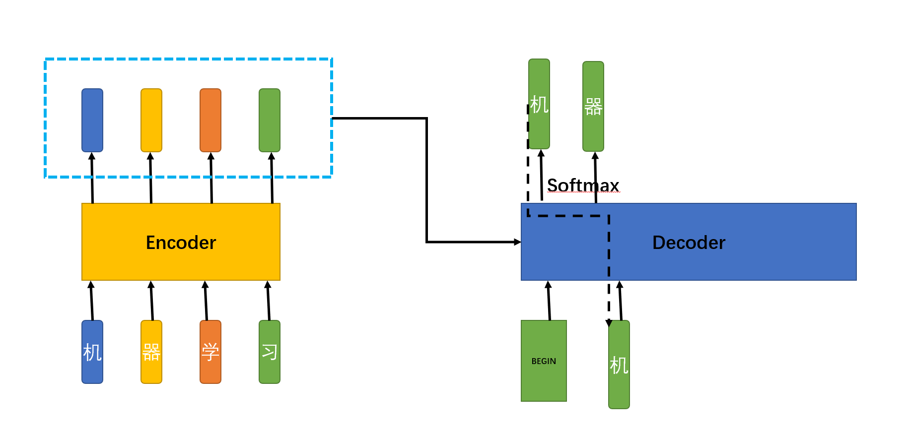      

接下来看一下Decoder的内部结构。  
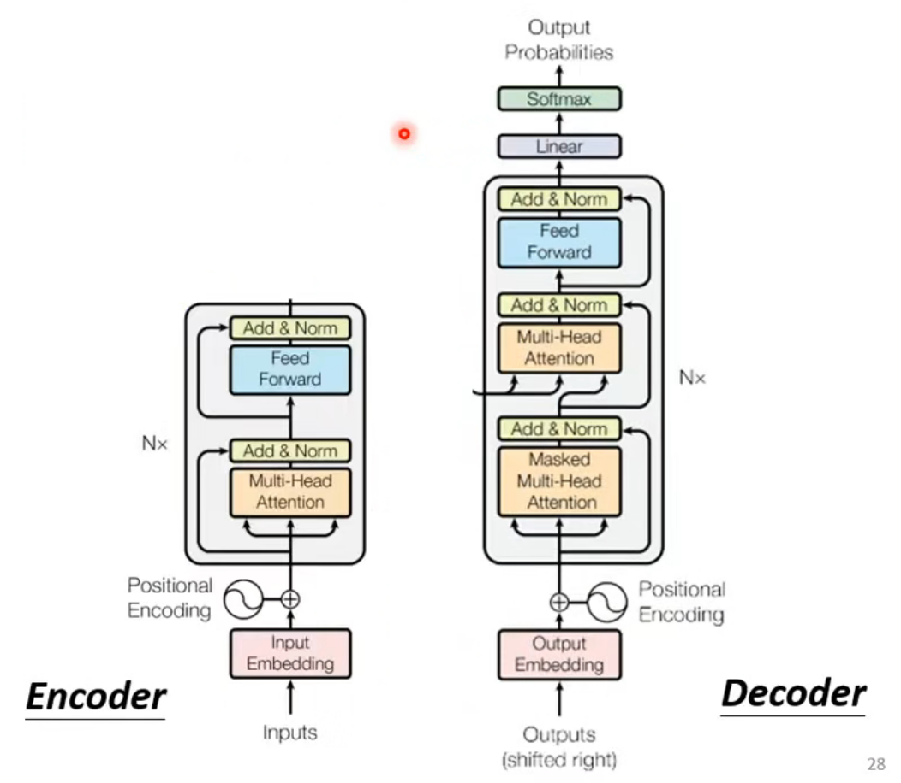    
Decoder里有一个Masked的多头Self-attention。
首先看一下原本的Self-atttion架构，在本架构中，输出b1,b2,b3,b4都要考虑到所有的输入(即a1,a2,a3,a4)的全部输入结果。  
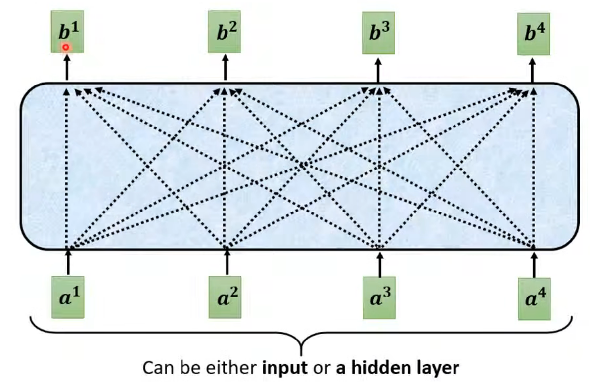    
如下则为Masked版本的Self-attention的架构，在输出b的时候，不能考虑在当前向量之后的向量信息。
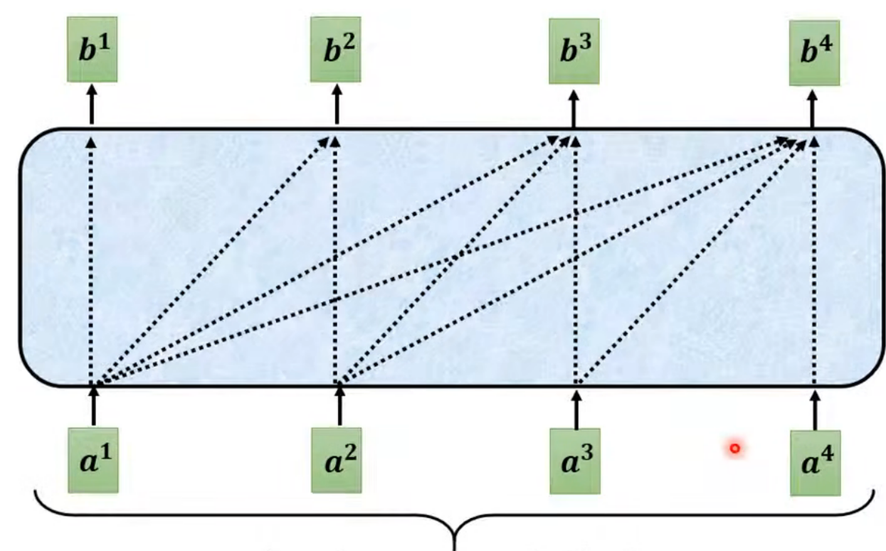    
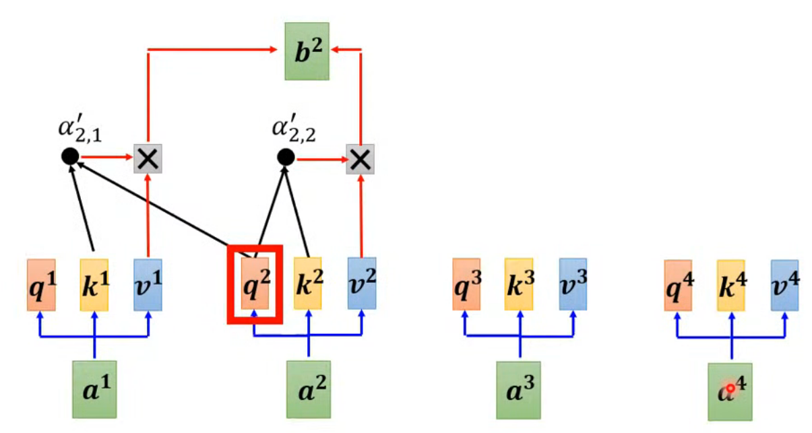    
因为在前文中，Decoder的输入是要逐步加入其在之前的输出结果的，所以Decoder只能考虑已经输出的信息，故而要使用Masked模型架构。  

Decoder必须要自己决定Sequence的输出长度是多少，在此的处理方式很简单，即将"结束输出"这个命令作为一个字符让机器学习。当检测到模型输出此字符，停止输出即可。 
注意，在此处的每次给Decoder输入的信息除了其本身的输出(Begin)也算之外，还有Encoder的输出结果，也就是说，Encoder的输出结果在Decoder中会被多次使用。  

+ NAT Decoder  

NAT不同于AT，AT Decoder是一个字一个字的产生输出。  
而NAt则是一次性产生了一整个句子，但是一开始并不知道要生成多长的句子，在此有两个方法来确定生成句子长度，一种方法是另外学习一个网络，结果是生成句子的长度。另外一种方法是自己假定句子长度上限，将最大长度上限送入Decoder，输出结果只卡"断"以前的作为结果:  
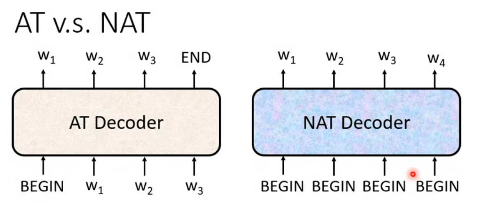     

NAT的好处是平行化，速度快，可以灵活控制其输出的长度。  

### 2.3 Decoder和Encoder关联
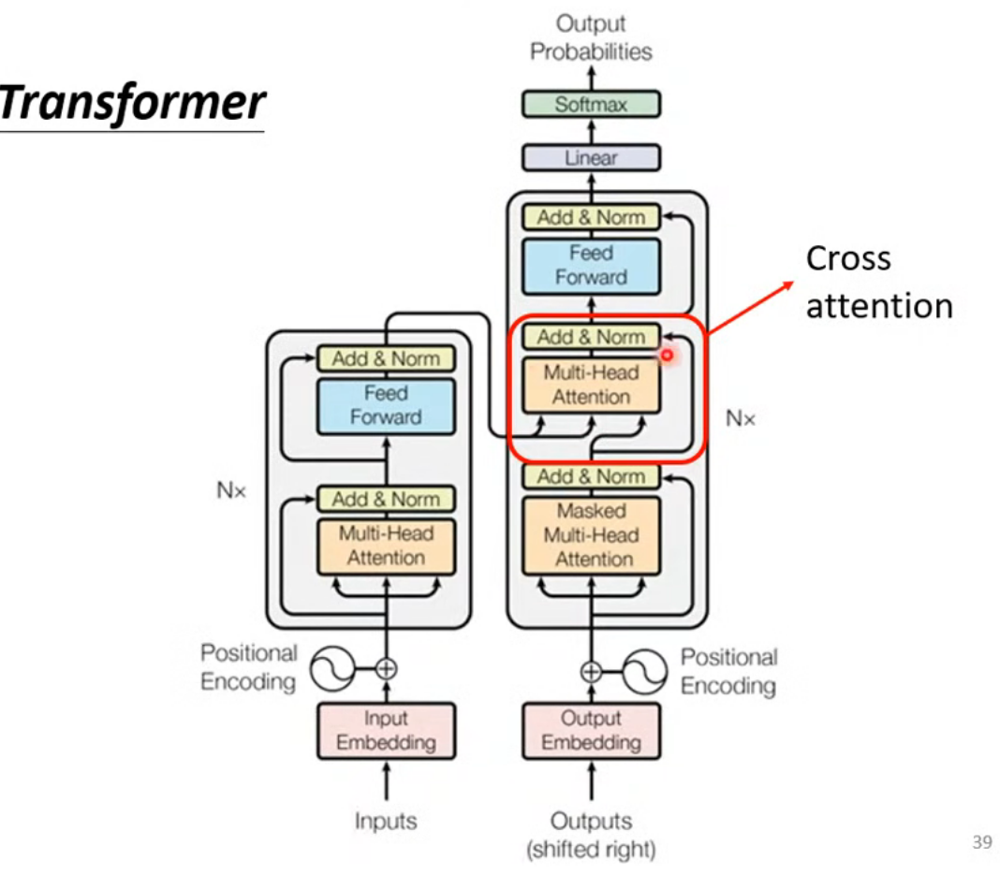     
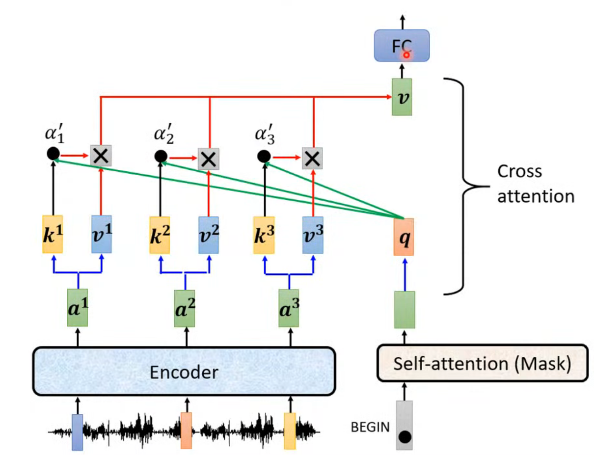     
红框部分称为Cross attention，是Decoder和Encoder的交互部分。
Decoder读取Begin信号，然后抽取Encoder中的k，一起运算产生v送入下一步运算。
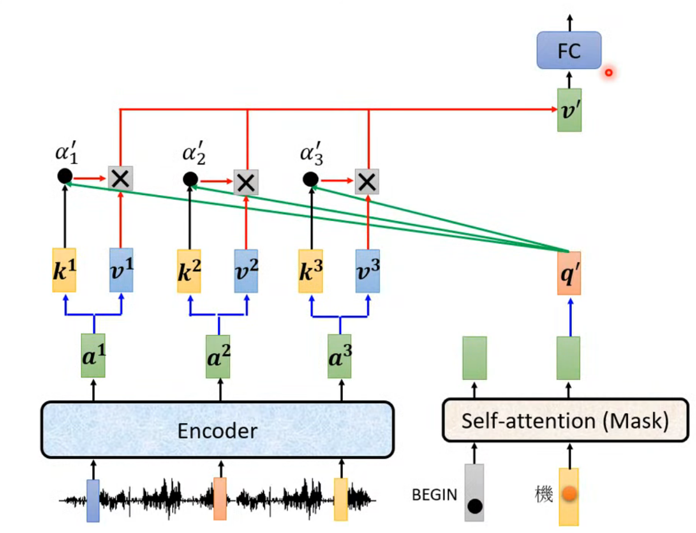     

## 3.编码实现  
+预热机制:  
Warmup是在ResNet论文中提到的一种学习率预热的方法，它在训练开始的时候从最初的小学习率开始，每个step增大一点点，直到达到最初设置的比较大的学习率时，采用最初设置的学习率进行训练,有助于使模型收敛速度变快，效果更佳。 
要实现梯度自行更新的机制,需要引入LambdaLR函数。  
```  
torch.optim.lr_scheduler.LambdaLR(optimizer, lr_lambda, last_epoch=-1, verbose=False)
# 设置学习率为初始学习率乘以给定lr_lambda函数的值

new_lr=lr_lambda(last_epoch) * base_lr

当 last_epoch=-1时, base_lr为optimizer优化器中的lr

每次执行 scheduler.step(),  last_epoch=last_epoch +1
```  

完整的代码实现:  
```
"""
前人研究表明:学习率的warm-up机制对训练Transfomer的架构的模型非常有用。
warm-up机制的步骤:
(1)在开始的时候设学习率为0.
(2)在warm-up阶段中,学习率从0线性的逐渐增加到预先设定好的阈值.
"""
import math
import torch
from torch.optim import Optimizer
from torch.optim.lr_scheduler import LambdaLR
def get_cosine_schedule_with_warmup(optimizer,num_warmup_steps,num_training_steps,num_cycles=0.5,last_epoch=-1):
    """
    optimizer:优化器
    num_warmup_steps:在大概多少个step后warmup阶段结束(代表梯度已经增长到了设定的阈值)
    num_training_steps:
    num_cycles:
    last_epocj:
    """
    def lr_lambda(current_step):
        if current_step < num_warmup_steps:
            return float(current_step) / float(max(1,num_warmup_steps))
        progress = float(current_step - num_warmup_steps) / float(max(1,num_training_steps-num_warmup_steps))
        return max(
      0.0, 0.5 * (1.0 + math.cos(math.pi * float(num_cycles) * 2.0 * progress))
    )

    # 设置学习率为初始学习率乘以给定lr_lambda函数的值
    return LambdaLR(optimizer, lr_lambda, last_epoch)
```
