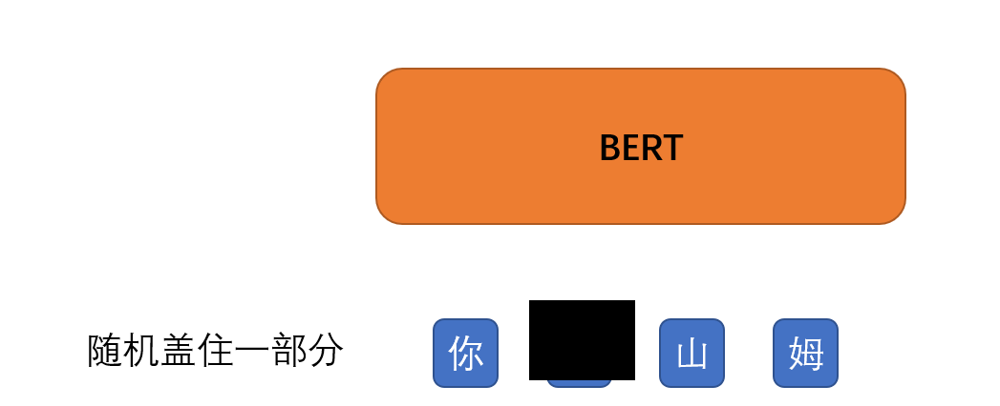
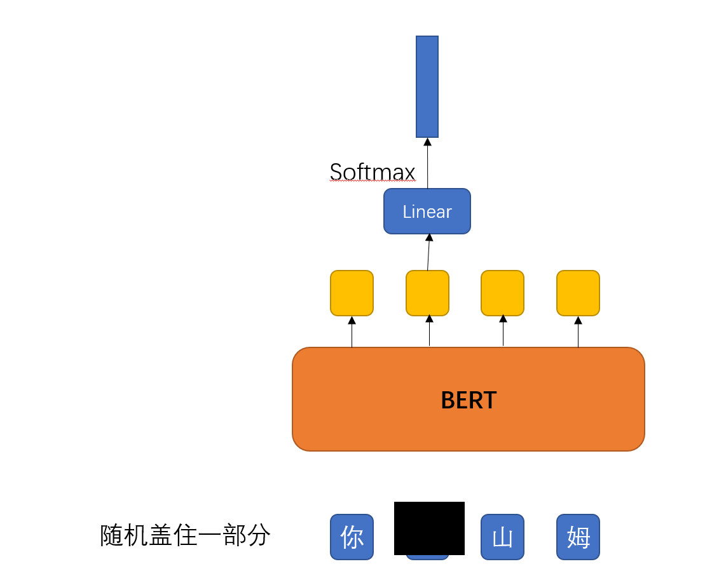
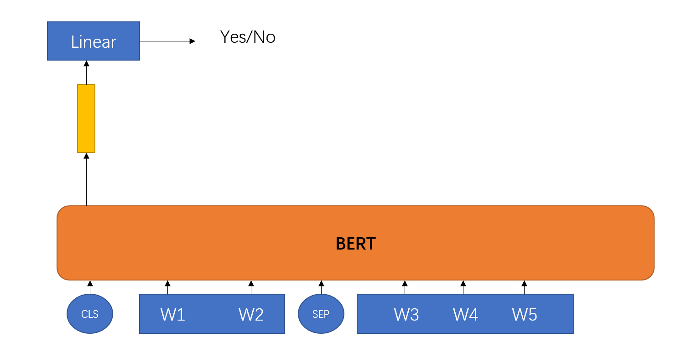

# 第7 Self-Supervised Learning  
自监督学习（self-supervised learning）可以被看作是机器学习的一种“理想状态”，模型直接从无标签数据中自行学习，无需标注数据。本文主要对当前自监督学习涉及到的一些方面进行总结（笔记）。  
+ 自监督学习的核心，在于如何自动为数据产生标签。
例如输入一张图片，把图片随机旋转一个角度，然后把旋转后的图片作为输入，随机旋转的角度作为标签。再例如，把输入的图片均匀分割成3*3的格子，每个格子里面的内容作为一个patch，随机打乱patch的排列顺序，然后用打乱顺序的patch作为输入，正确的排列顺序作为label。类似这种自动产生的标注，完全无需人工参与。  

+ 自监督学习如何评价性能？
自监督学习性能的高低，主要通过模型学出来的feature的质量来评价。feature质量的高低，主要是通过迁移学习的方式，把feature用到其它视觉任务中（分类、分割、物体检测...），然后通过视觉任务的结果的好坏来评价。目前没有统一的、标准的评价方式。
+ 自监督学习的一个研究套路。
前面说到，自监督学习的核心是如何给输入数据自动生成标签。之前的很多工作都是围绕这个核心展开的。一般的套路是：首先提出一个新的自动打标签的辅助任务（pretext task，例如：旋转图片、打乱patch顺序），用辅助任务自动生成标签，然后做实验、测性能、发文章。每年都有新的辅助任务被提出来，自监督学习的性能也在不断提高，有的甚至已经接近监督学习的性能。总体上说，或者是提出一种完全新的辅助任务，或者是把多个旧的辅助任务组合到一起作为一个“新”的辅助任务。
## 1.Bert
### 1.1 Masking Input
在没有label的情况下，自行对数据进行标注。  
可以看成是一种无监督学习的方法。  
  
两种实现方式:  
(1)替换为一个从未在字典里出现过的内容。  
(2)随机找个字来替换。  
  
被盖起来的向量经过bert后输出一个向量，在经过softmax后输出为一个分布。 
由于我们已经知道被盖起来的向量的内容，从而通过计算交叉熵可以计算损失。  
相当于Bert要学习被Masked起来的向量的值是何物。  

### 1.2 Next Sentence Prediction 
  
如果bert遇到两个相连的句子，则输出yes判断两句相连，反之则no认为两句不相连。  
判断两个句子该不该被接在一起。  

Bert的作用:填空和定序。  

Bert可以Fine-tune成各式各样的模型。
Bert的意义是模型中的Bert部分不再是完全随机初始化，而是使用pre-train中的Bert的参数来作为输入，这样的结果会比随机初始化的模型好得多。 
产生Bert的过程称为pre-train。  

### 1.3如何使用Bert  
+ case1: Sentiment analysis
仍然需要一部分标注数据，然后才开始训练Bert模型。
好处:  
模型收敛比较快，损失值会更小。 

## 2.代码实践  
+ 中文文章抽取和问答
    + 输入:文章和问题
    + 输出: 答案

+ 目标:学习如何fine tune一个预训练模型。  
+ Todo:  
    + Fine tune一个预训练中文BERT模型
    + 微调预先训练的中文BERT模型。
    + 更改超参数(例如，doc_stride)。
    + 应用线性学习速率衰减。
    + 尝试其他预先培训的模型。
    + 提升预处理。
    + 提升后处理。  

+ 训练技巧
    + 自动混合精度
    + 梯度累积
    + Ensemble  

+ 预估训练时间  
    + Simple: 8mins
    + Medium: 8mins
    + Strong: 25mins
    + Boss: 2hrs